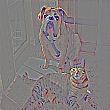
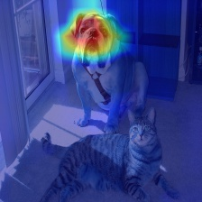
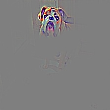

# keras-gradcam
Keras implementation of GradCAM.

Adapted and optimized code from https://github.com/jacobgil/keras-grad-cam.

Original torch implementation: https://github.com/ramprs/grad-cam.

To run script: `python grad_cam.py </path/to/img>`.

[Notebook](https://github.com/eclique/keras-gradcam/blob/master/gradcam_vgg.ipynb) has more details on usage and code to efficiently process multiple images.

### Description
Repository contains implementation of three approaches to explain base model predictions:
- [**Guided Backpropagation**](https://arxiv.org/abs/1412.6806);
- [**Grad-CAM**](https://arxiv.org/abs/1610.02391);
- **Guided Grad-CAM**, which is just multiplication of the first two.

Implementation uses Tensorflow as backend and VGG16 as base model.

### Examples

